# InfraGuard

> **Enterprise Runtime Security Platform for AI Agents**

*Human-in-the-loop Zero-Trust security for autonomous AI systems, stopping malicious payloads before execution.*

---

<p align="center">
  
  
  
  
  
  
  
  
  
</p>

## Table of Contents

- [Overview](#overview)
- [Project Motivation](#project-motivation)
- [Key Features](#key-features)
- [Architecture](#architecture)
- [Security Workflow](#security-workflow)
- [Technology Stack](#technology-stack)
- [Project Structure](#project-structure)
- [Installation](#installation)
- [Running the Project](#running-the-project)
- [Demo Workflow](#demo-workflow)
- [Screenshots](#screenshots)
- [Roadmap & Limitations](#roadmap--limitations)
- [License & Acknowledgements](#license--acknowledgements)

---

## Overview

**InfraGuard** is a Zero-Trust Runtime Security Platform designed specifically for the AI era. It protects infrastructure by intercepting JSON-RPC tool invocations from AI agents before they execute on the host machine. 

InfraGuard enables system administrators to monitor, inspect, and control AI agent actions in real time through an **Enterprise SOC Dashboard** (Web) and a companion **Flutter Mobile Admin** application, bridging the gap between autonomous automation and secure human oversight.

## The Problem: AI Agents are a Security Blindspot

Modern AI Agents can autonomously execute powerful tools (shell commands, database queries, file operations). However, granting autonomous agents infrastructure access creates a massive attack surface. 

**The numbers prove it's a critical threat:**
- **High Incident Rate:** 88% of companies using AI agents in production have experienced at least one security incident.
- **The Perception Gap:** Despite this, 82% of those companies mistakenly believe their current security is sufficient.
- **Catastrophic Costs:** The average cost of a single AI agent security incident is **$2.3M**, with real-world examples including $1-5M for accidental database deletions and $500K-$2M for credential leaks.
- **Systematic Vulnerability:** Only 5% of companies have a systematic way to prevent or stop risky AI actions before they execute. 

Recent high-profile attacks (e.g., CVE-2025-21852 in April 2026, where attackers hijacked AI coding assistants via hidden GitHub PR instructions) demonstrate that prompt injection is a reality. Current approaches like "monitoring logs" are too slow; by the time a threat is detected in logs (5-30 mins), the damage is already done.

## The Solution: InfraGuard Zero-Trust Proxy

If you're running AI agents with infrastructure access without a kill-switch, it's not a question of *if* you'll have an incident, but *when* and *how much it'll cost*.

**InfraGuard** solves this by acting as a Zero-Trust interception layer. 
- **Lightning Fast Interception:** We intercept payloads in < 100ms.
- **Human-in-the-Loop:** Alerts are sent to a human admin via mobile push notification in < 2 seconds.
- **Rapid Resolution:** Total time to stop damage is < 40 seconds (compared to 30-120 minutes with traditional logging).

<p align="center">
  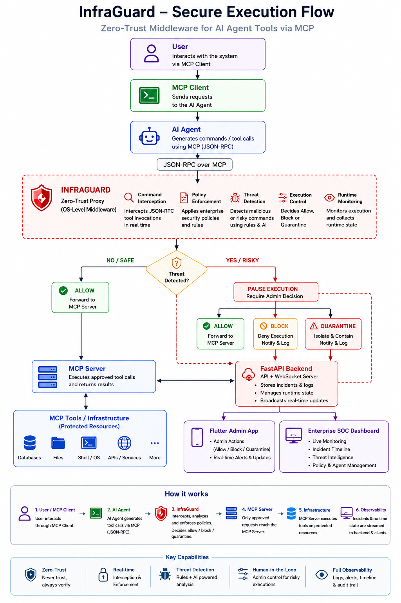
</p>

InfraGuard mitigates this massive attack surface by intercepting, evaluating, and optionally blocking these actions *before* execution, ensuring you have the final say over what your AI agents deploy.

## Key Features

<details>
<summary><b>Backend (Zero-Trust Proxy)</b></summary>

- **Zero-Trust Runtime Proxy:** Intercepts all outgoing AI agent requests.
- **JSON-RPC Parser:** Normalizes and parses agent tool invocations.
- **Threat Detection Engine:** Algorithmic risk-scoring based on command semantics.
- **Rule-based Security:** Enforces strict execution boundaries.
- **Execution Controller:** Pauses the execution thread asynchronously pending admin review.
- **Incident Management:** Caches and logs all flagged payloads.
- **FastAPI Backend:** High-performance async processing.
- **WebSocket Synchronization:** Sub-millisecond state broadcasts to all connected clients.

</details>

<details>
<summary><b>Frontend (Admin Clients)</b></summary>

**Enterprise SOC Dashboard (Web) & Flutter Admin App (Mobile/Desktop)**
- **Real-time Notifications:** Instant alerts on threat detection.
- **Live Runtime Stream:** Streaming view of system health and WebSocket events.
- **Incident Timeline:** Historical ledger of all system events.
- **Threat Details:** In-depth view of intercepted payloads.
- **Payload Viewer:** Formatted JSON viewer for quick forensic analysis.
- **Admin Actions:** Direct controls to enforce security:
  - **ALLOW:** Approve and execute the payload.
  - **BLOCK:** Drop the payload and return an error to the agent.
  - **QUARANTINE:** Isolate the payload for forensic review and lock the session.

</details>

## Architecture

<p align="center">
  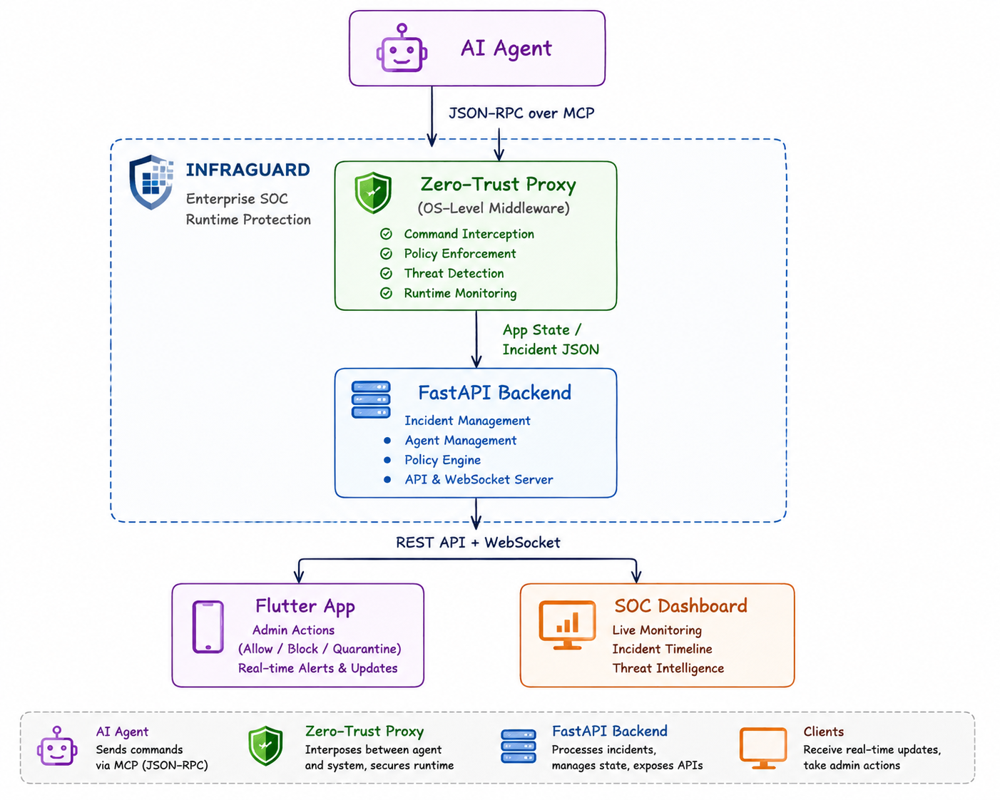
</p>

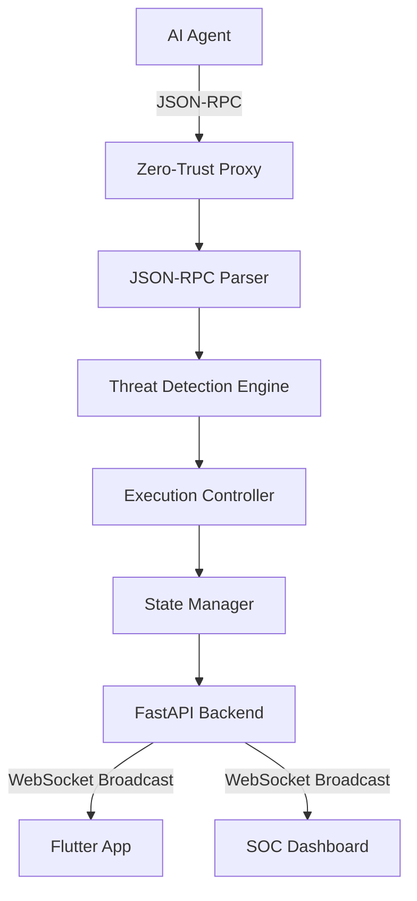

## Security Workflow

The core protection loop follows a strict Zero-Trust model:

`Prompt Injection` ➔ `Compromised AI Agent` ➔ `JSON-RPC Payload` ➔ `Proxy Interception` ➔ `Threat Detection` ➔ `Execution Pause` ➔ `Admin Decision` ➔ **ALLOW / BLOCK / QUARANTINE**

## Technology Stack

| Domain | Technologies |
| :--- | :--- |
| **Backend** | Python, FastAPI, WebSockets |
| **Frontend Mobile** | Flutter, Dart |
| **Frontend Web** | HTML5, Vanilla CSS3, JavaScript |
| **Networking/Deployment** | ngrok (Secure Tunneling), WebSockets |

## Project Structure

```text
InfraGuard/
├── backend/                  # Core API and Proxy Logic
│   ├── agents/               # AI Agent simulators
│   ├── api/                  # FastAPI routes and WebSocket logic
│   └── proxy/                # Zero-Trust Proxy & Threat Detection
├── frontend/
│   ├── flutter_app/          # Cross-platform Mobile/Desktop Admin App
│   └── web_dashboard/        # Enterprise SOC Dashboard (HTML/JS/CSS)
├── docs/                     # Documentation and Demo Assets
└── demo_data/                # Mock payloads for testing
```

## Installation

### 1. Backend Setup
```bash
# Clone the repository
git clone https://github.com/yourusername/InfraGuard.git
cd InfraGuard/backend

# Create virtual environment and install dependencies
python -m venv venv
source venv/bin/activate  # On Windows: venv\Scripts\activate
pip install -r requirements.txt
```

### 2. Flutter Admin App Setup
```bash
cd ../frontend/flutter_app
flutter pub get
```

### 3. Web Dashboard Setup
The Web Dashboard relies on static assets. No build step is required.
```bash
cd ../web_dashboard
# Simply open index.html in a modern browser
```
*Alternatively, deploy the `web_dashboard` directory to Netlify or Vercel.*

## Running the Project

To simulate a complete deployment, you will need multiple terminal sessions.

**Terminal 1: Proxy Engine & Backend Server**
*(The proxy engine will automatically start the FastAPI server internally on port 8000)*
```bash
cd backend
python simulate_agent.py
```

**Terminal 2: Secure Tunneling (Optional)**
```bash
# Expose the local backend to the internet for remote Flutter app connectivity
ngrok http 8000
```

**Clients:**
- **SOC Dashboard:** Open `frontend/web_dashboard/index.html` in your browser.
- **Flutter App:** Run `flutter run` in the `frontend/flutter_app` directory.

## Demo Workflow

Follow these steps to demonstrate the full power of InfraGuard:

1. **Run Safe Agent:** Initiate a benign command (e.g., `get_system_uptime`).
2. **Observe Dashboard:** Note the system remains in a "Secure State" and the action is logged.
3. **Run Malicious Agent:** Simulate a prompt injection attack (e.g., `rm -rf /`).
4. **Threat Intercepted:** The Proxy halts execution instantly.
5. **Mobile Notification:** A push notification triggers on the Flutter app.
6. **Admin Decision:** Open the payload in the app and choose an action.
7. **ALLOW:** Demonstrate overriding a false positive.
8. **BLOCK:** Demonstrate dropping the malicious command.
9. **QUARANTINE:** Demonstrate isolating the payload.
10. **Real-time Synchronization:** Observe all states syncing sub-millisecond across the Mobile App and SOC Dashboard via WebSockets.

## Screenshots

| Mobile Splash | Flutter Dashboard | SOC Dashboard |
| :---: | :---: | :---: |
| 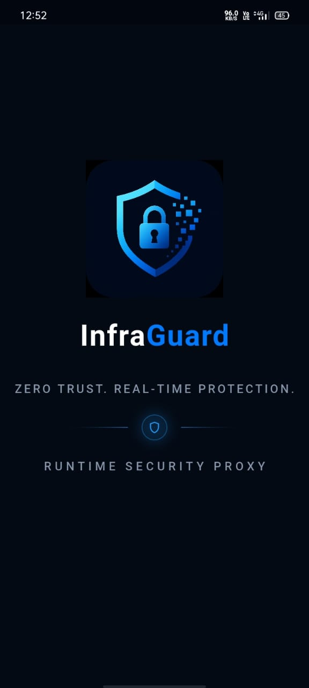 | 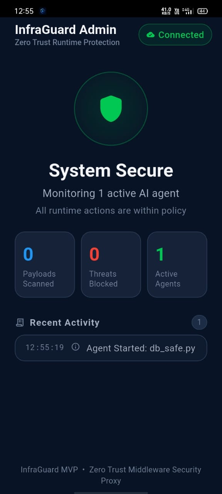 | 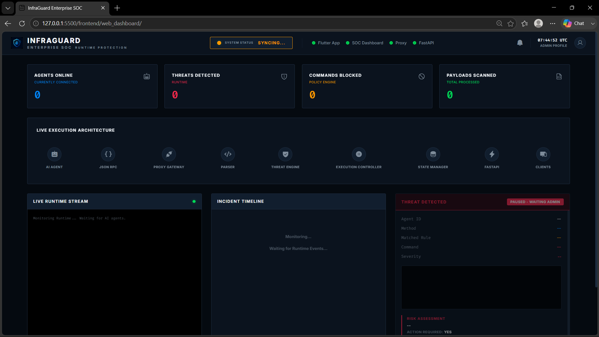 |

| Threat Detection | Payload Viewer | Runtime Stream |
| :---: | :---: | :---: |
| 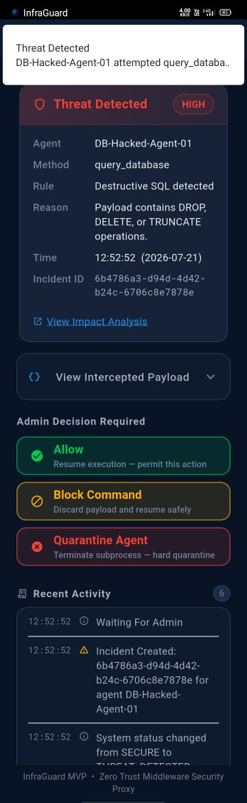 | 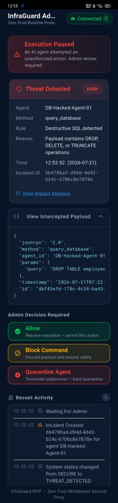 | 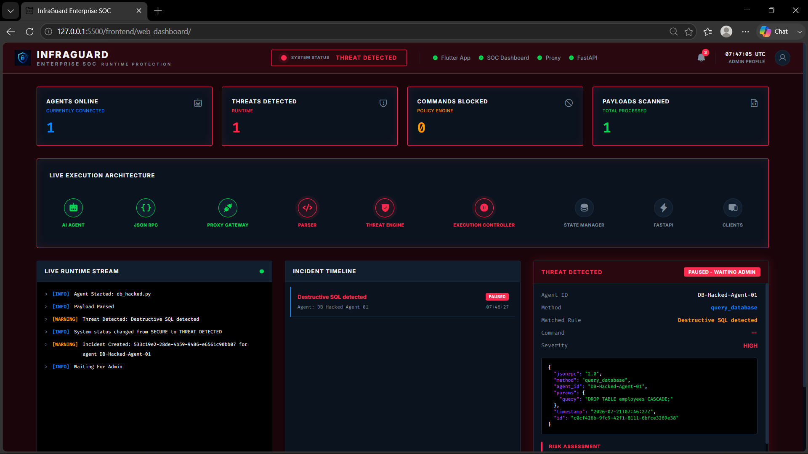 |

| Incident Timeline | Admin Decision | Quarantined |
| :---: | :---: | :---: |
| 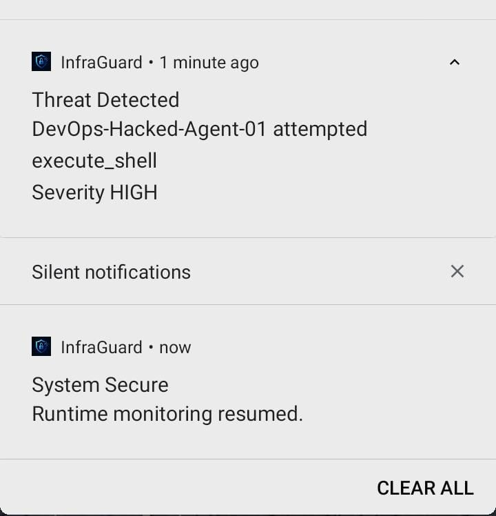 | 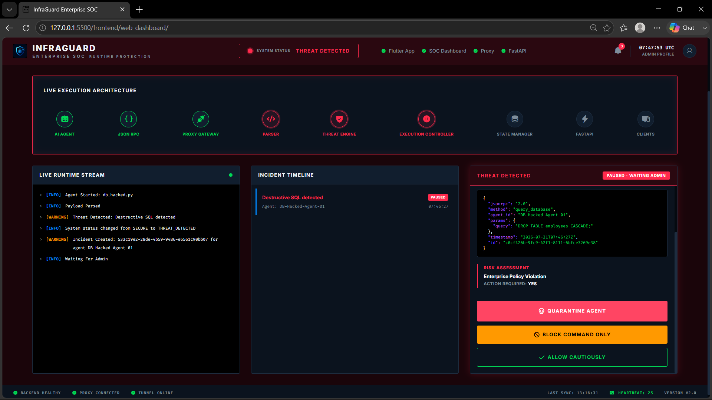 | 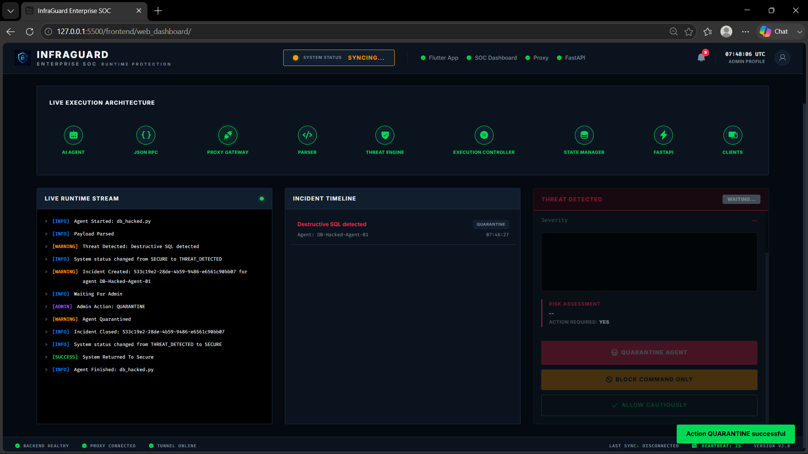 |

## Roadmap & Limitations (Path to MVP 2)

### Known Limitations (MVP 1)
- **Ruleset Rigidity:** The Threat Detection Engine currently relies on a rigid algorithmic ruleset optimized for speed. Highly sophisticated zero-day obfuscations might bypass basic string matching.
- **In-Memory State:** The current state manager runs in-memory. If the FastAPI process restarts, the incident history is cleared.
- **Unencrypted Local WebSockets:** The MVP relies on standard WebSockets without WSS/TLS for local development.

### MVP 2: Future Roadmap & Hardening
To transition from a functional prototype to a production-grade enterprise product, MVP 2 will focus on ML integration and self-protection.

- **AI-Powered Threat Detection:** Integrating a fast, specialized small language model (SLM) to evaluate the *semantic intent* of payloads rather than relying solely on syntactical patterns.
- **Database Persistence:** Migrating state management to PostgreSQL/TimescaleDB for robust historical querying and long-term audit logs.
- **Authentication & RBAC:** Enforcing strict OAuth2/JWT validation for the API and WebSockets, plus Role-Based Access Control for multi-admin teams.

### Securing the Security Tool (Self-Protection)
A security tool is only as good as its own defenses. MVP 2 will implement safeguards to ensure InfraGuard itself cannot be compromised:
- **Proxy Isolation:** The proxy will run in a hardened, isolated Docker container or separate VM, stripped of all unnecessary privileges, preventing an escaping AI agent from tampering with the proxy's own memory or binaries.
- **Cryptographic Nonces:** Implementing strict nonce validation to prevent replay attacks on the `/api/resolve` endpoints.
- **Mutual TLS (mTLS):** Enforcing mTLS between the AI Agents and the Proxy to ensure only authorized agents can submit payloads to the engine.


## Copyright

© 2026 Riya Maity. All rights reserved.

This repository is published for portfolio, educational, and demonstration purposes only.

No permission is granted to copy, modify, redistribute, or use this source code without prior written permission from the author.

## Acknowledgements
- [FastAPI](https://fastapi.tiangolo.com/)
- [Flutter](https://flutter.dev/)
- [WebSocket](https://developer.mozilla.org/en-US/docs/Web/API/WebSockets_API)
- [Python](https://www.python.org/)

## References & Research

1. **Building an AI Firewall & Securing MCP**
   - **Source:** Costa Security Blog
   - **Key Insight:** Provided architectural foundations for safely intercepting Model Context Protocol (MCP) payloads and designing middleware security.
   - [Read Article](https://blog.costa.security/building-an-ai-firewall-three-things-i-learned-while-securing-mcp-f9a19b910a02)

2. **The State of Secrets Sprawl 2026**
   - **Source:** GitGuardian
   - **Key Insight:** Validates our "Fatal Gap" argument—traditional API keys and local IAM roles are increasingly compromised, proving the critical need for our Out-of-Band Mobile Auth.
   - [Read Report](https://blog.gitguardian.com/the-state-of-secrets-sprawl-2026/)

3. **MCP Security Statistics 2026 Report**
   - **Source:** Practical DevSecOps
   - **Key Insight:** Industry statistics highlighting the rapid adoption of AI agents and the escalating threat of unauthorized execution via legitimate permissions.
   - [Read Report](https://www.practical-devsecops.com/mcp-security-statistics-2026-report/?srsltid=AfmBOoqXcU1LkesK5K-ezZuswru9zRYWbB--nhw9ywtO3oqTqJAamdv2)

---
*Securing the Autonomous Enterprise.*
