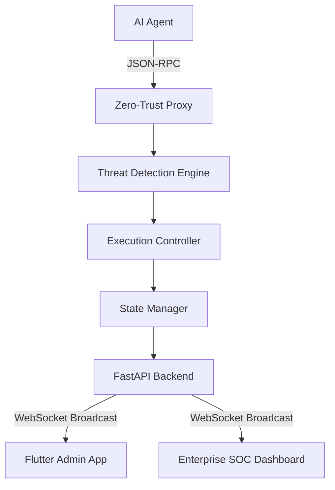

# System Architecture

The following diagram illustrates the core components and data flow of the InfraGuard platform, highlighting the real-time pipeline from AI agent execution through the Zero-Trust Proxy, down to the multi-platform admin and SOC dashboards.

