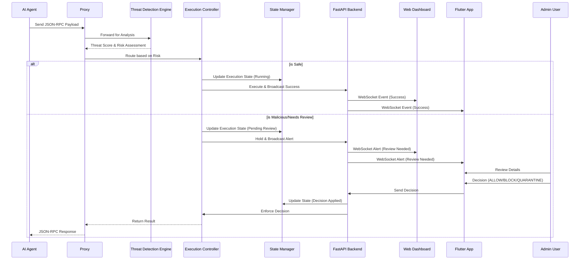

# Sequence Diagram

This sequence diagram depicts the interaction between the system's various components when a new command or payload is initiated by an AI Agent.

```mermaid
sequenceDiagram
    participant Agent as AI Agent
    participant Proxy as Proxy
    participant Detector as Threat Detection Engine
    participant Controller as Execution Controller
    participant State as State Manager
    participant API as FastAPI Backend
    participant Web as Web Dashboard
    participant App as Flutter App
    participant Admin as Admin User

    Agent->>Proxy: Send JSON-RPC Payload
    Proxy->>Detector: Forward for Analysis
    Detector-->>Proxy: Threat Score & Risk Assessment
    Proxy->>Controller: Route based on Risk
    
    alt is Safe
        Controller->>State: Update Execution State (Running)
        Controller->>API: Execute & Broadcast Success
        API->>Web: WebSocket Event (Success)
        API->>App: WebSocket Event (Success)
    else is Malicious/Needs Review
        Controller->>State: Update Execution State (Pending Review)
        Controller->>API: Hold & Broadcast Alert
        API->>Web: WebSocket Alert (Review Needed)
        API->>App: WebSocket Alert (Review Needed)
        
        Admin->>App: Review Details
        Admin->>App: Decision (ALLOW/BLOCK/QUARANTINE)
        App->>API: Send Decision
        API->>State: Update State (Decision Applied)
        API->>Controller: Enforce Decision
        Controller-->>Proxy: Return Result
        Proxy-->>Agent: JSON-RPC Response
    end
```
