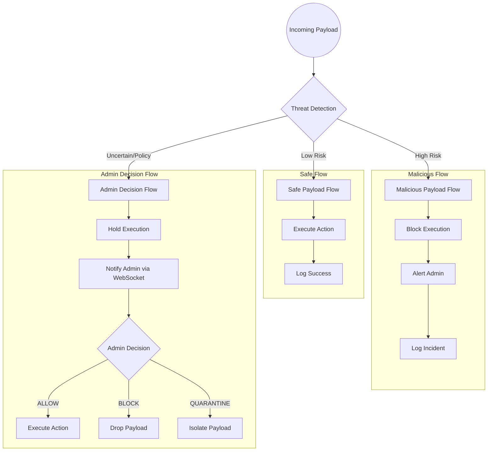

# Request Flow Architecture

InfraGuard handles payloads dynamically based on their threat assessment and admin decisions. The flows below outline safe execution, malicious blocking, and administrative quarantine procedures.

## Core Flow Diagrams

