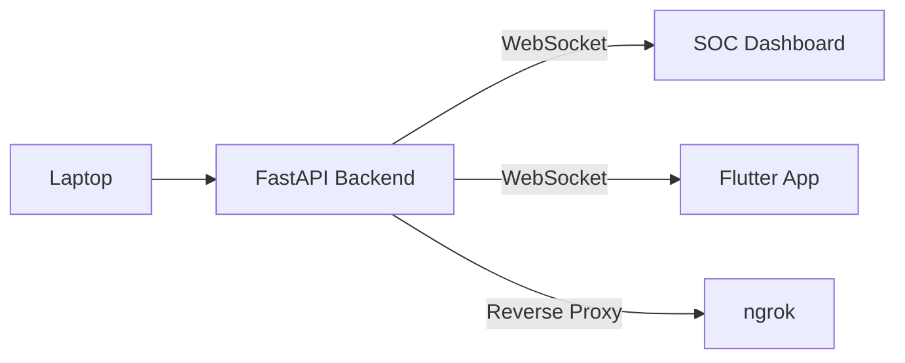

# Deployment Architecture

InfraGuard supports flexible deployment topologies suitable for local testing, internal network administration, and secure remote access via tunneling.

## Deployment Scenarios

### Local Development
In a purely local setup, all components run on localhost. The AI Agent sends JSON-RPC requests to the local FastAPI server. The Flutter app (running in emulator or desktop mode) and the Web SOC Dashboard connect to local WebSocket endpoints.

### LAN (Local Area Network)
The FastAPI server binds to `0.0.0.0` or a specific network interface. Devices on the same Wi-Fi or LAN segment (e.g., a physical mobile device running the Flutter Admin App) can connect to the backend using its local IP address.

### Remote (via ngrok)
For remote access, `ngrok` is used to expose the FastAPI backend to the public internet securely. The Flutter app and remote SOC analysts can connect to the `ngrok` URL (both for REST API calls and WebSocket connections) to monitor and control the system from anywhere.
