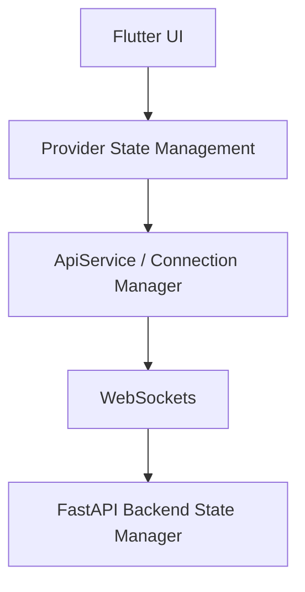

# InfraGuard Mobile Admin

## Overview

The InfraGuard Mobile Admin Application is a cross-platform (iOS, Android, Desktop) interface built with Flutter. 

### Purpose
Its core purpose is to provide system administrators with instant, on-the-go human oversight of their autonomous AI agents. Whenever the Zero-Trust Proxy intercepts a high-risk or malicious JSON-RPC payload, the Mobile Admin app receives an immediate push notification, allowing the admin to review the payload and enforce a security decision before any execution occurs.

## Key Features

- **Runtime Threat Monitoring:** Live surveillance of AI agent activity streams.
- **Live Incident Viewer:** Richly formatted JSON views of intercepted payloads.
- **Real-time WebSocket Synchronization:** Sub-millisecond state updates synced with the backend and Web SOC Dashboard.
- **Allow:** Override false positives and permit payload execution.
- **Block:** Intercept and drop malicious payloads instantly.
- **Quarantine:** Isolate the threat and lock the offending AI agent session.
- **Enterprise Dark UI:** Professional, distraction-free Material 3 dark theme.
- **Notifications:** Instant system-level alerts when threats are detected.

## Architecture



## Screens

- **Splash Screen:** Initializing and connection bootstrap.
- **Dashboard:** The primary runtime monitor (Secure vs. Alert states).
- **Threat Details:** Expanded view containing payload specifics and the action panel (Allow/Block/Quarantine).
- **Connection Status:** Dynamic badging indicating WebSocket health (Online/Offline/Connecting).
- **Notifications:** In-app and lock-screen push alerts.

## Folder Structure

```text
frontend/flutter_app/
├── android/            # Native Android runner
├── ios/                # Native iOS runner
├── lib/                # Flutter source code
│   ├── models/         # AppState, ConnectionStatus models
│   ├── providers/      # ThreatProvider (ChangeNotifier)
│   ├── screens/        # Dashboard, Settings, Splash
│   ├── services/       # ApiService, NotificationService
│   ├── theme/          # AppTheme (Dark Mode definitions)
│   ├── widgets/        # Reusable UI components
│   └── main.dart       # Application entry point
├── pubspec.yaml        # Flutter dependencies
└── README.md           # This documentation
```

## Dependencies

Core packages powering this app (found in `pubspec.yaml`):
- `provider`: Application state management.
- `web_socket_channel`: Persistent real-time backend connections.
- `flutter_local_notifications`: Native push alerts.
- `http`: REST API fallback requests.
- `google_fonts`: Modern typography (Inter/Roboto).
- `shared_preferences`: Local configuration caching.

## How to Run

1. **Install dependencies:**
   ```bash
   flutter pub get
   ```
2. **Run the application:**
   ```bash
   flutter run
   ```

## Connection Requirements

To connect to the FastAPI backend, you must configure the backend URL in the Settings screen. The app supports:

- **USB / Localhost:** Requires port forwarding (e.g., `adb reverse tcp:8000 tcp:8000`) or using the emulator IP (`10.0.2.2`).
- **LAN (Local Area Network):** Connect directly to the host machine's IP (e.g., `192.168.1.50:8000`).
- **ngrok (Recommended):** Input a public ngrok HTTPS URL for seamless remote access and testing.
- **Auto Detect:** The app will attempt to default to a local host if no URL is explicitly provided.

## Known Limitations

- **State Persistence:** Incident history is currently cached in memory; a cold restart clears local logs.
- **Background Execution:** WebSockets may drop when the app is backgrounded on iOS/Android for extended periods.

## Future Improvements

- Implementation of Firebase Cloud Messaging (FCM) for reliable background push notifications.
- OAuth2/JWT Authentication flow for secure administrator logins.
- Local SQLite caching for offline review of the Incident Timeline.
- Biometric authentication (FaceID/TouchID) before allowing critical payload overrides.

## Screenshots

| Splash | Dashboard (Secure) | Dashboard (Threat) |
| :---: | :---: | :---: |
| *(Placeholder)* | *(Placeholder)* | *(Placeholder)* |

| Payload Viewer | Settings | Notifications |
| :---: | :---: | :---: |
| *(Placeholder)* | *(Placeholder)* | *(Placeholder)* |
