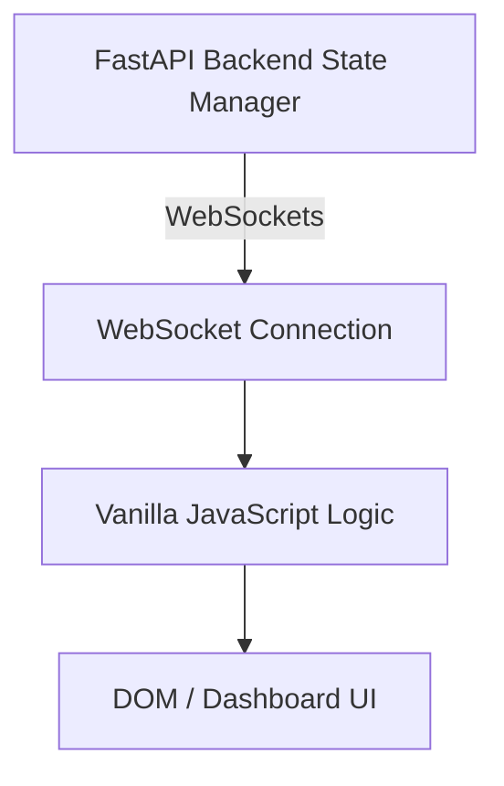

# InfraGuard Enterprise SOC Dashboard

## Overview

The InfraGuard Enterprise SOC (Security Operations Center) Dashboard is the central web-based interface for monitoring and managing the real-time runtime security of AI Agents. 

### Purpose
Designed for large screens and multi-monitor SOC environments, this dashboard gives security analysts a comprehensive, sub-millisecond view into the active Zero-Trust proxy. It displays live AI agent payloads, highlights intercepted threats, and allows administrators to oversee actions as they happen, ensuring no unauthorized or hallucinated payload executes against the system's infrastructure.

## Key Features

- **Live Runtime Stream:** A streaming, terminal-like feed of raw WebSocket events coming from the execution controller.
- **Incident Timeline:** A chronological ledger of all events, threats, and executed admin decisions.
- **Threat Detail Panel:** Contextual breakdown of an active or past threat, highlighting the exact malicious command.
- **Payload Viewer:** A beautifully formatted JSON viewer for deep-dive forensic inspection of intercepted JSON-RPC payloads.
- **Execution Pipeline:** Visual representation of the payload's journey from the AI Agent, through the Proxy, to the Target.
- **Statistics Cards:** Quick-glance metrics for Active Agents, Payloads Processed, and Threats Blocked.
- **Connected Clients:** Real-time visibility into active mobile and web admin connections.
- **WebSocket Synchronization:** Instant state changes perfectly synchronized with the backend and the Flutter mobile app.

## Architecture



## Folder Structure

```text
frontend/web_dashboard/
├── assets/             # Images, icons, and static assets
├── index.html          # Main HTML structure and layout grid
├── style.css           # Vanilla CSS3 styling, animations, and glassmorphism
├── app.js              # Vanilla JavaScript logic and WebSocket client
└── README.md           # This documentation
```

## How to Run

Because the SOC dashboard is built entirely with vanilla web technologies, there are no build steps or heavy dependencies.

### Open Locally
Simply open the `index.html` file in any modern web browser:
```bash
# MacOS / Linux
open index.html

# Windows
start index.html
```

### Deploy using Netlify
The dashboard can be deployed as a static site in seconds. 
1. Drag and drop the `web_dashboard/` folder into Netlify Drop.
2. Or connect the repository to Vercel/Netlify, setting `frontend/web_dashboard/` as the root directory with no build command.

## Configuration

By default, the dashboard attempts to connect to `ws://localhost:8000/api/ws`.

### Backend URL / WebSocket URL
To connect the dashboard to a remote backend (such as an ngrok tunnel or production server), update the connection string at the top of `app.js`:
```javascript
// Example modification in app.js
const wsUrl = 'wss://your-ngrok-url.ngrok.app/api/ws';
```

## Responsive Design

The Enterprise SOC Dashboard is styled with modern CSS Grid and Flexbox. While it is optimized for high-resolution desktop monitors common in Security Operations Centers, the layout gracefully collapses into single-column views on tablets and smaller screens to ensure accessibility in all scenarios.

## Dashboard Components

1. **Header:** Status indicator and connection health.
2. **Metrics Row:** Key statistical counters.
3. **Primary View (Center):** The Incident Timeline and execution pipeline visualizer.
4. **Detail View (Right):** The Payload Viewer (JSON) and Threat Detail Panel.
5. **Runtime Stream (Bottom):** Live event log scrolling in real-time.

## Technology Stack

- **HTML5:** Semantic document structure.
- **CSS3 (Vanilla):** CSS Variables, Grid, Flexbox, glassmorphism aesthetics, and keyframe animations. No CSS frameworks (e.g., Tailwind) are required.
- **JavaScript (Vanilla):** ES6+ syntax handling DOM manipulation and state. No JS frameworks (e.g., React, Vue) are required.
- **WebSocket API:** Native browser `WebSocket` interface for bi-directional communication.

## Known Limitations

- The dashboard currently relies on in-memory arrays in `app.js` to store the local timeline state. Refreshing the browser will clear the local history (though the backend retains its state).
- The raw JSON payload viewer lacks a robust copy-to-clipboard button for highly complex, nested objects.

## Future Improvements

- Implementation of user authentication (JWT) before establishing the WebSocket connection.
- A dedicated "Historical Analysis" tab that queries a Time-Series Database (e.g., PostgreSQL) via REST API to retrieve payloads from previous days.
- Theme toggles (Light/Dark mode), though Dark mode is strictly preferred for SOC environments.

## Screenshots

| Dashboard - Secure State | Dashboard - Threat Intercepted |
| :---: | :---: |
| *(Placeholder)* | *(Placeholder)* |

| Payload Viewer | Runtime Stream |
| :---: | :---: |
| *(Placeholder)* | *(Placeholder)* |
